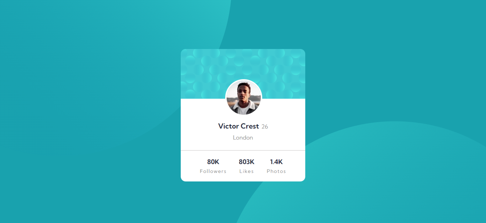
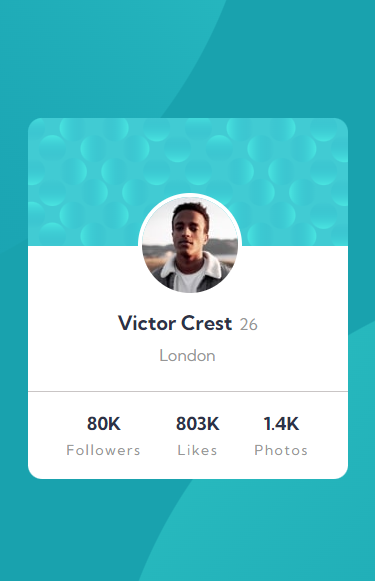

# Frontend Mentor - Profile card component solution

This is a solution to the [Profile card component challenge on Frontend Mentor](https://www.frontendmentor.io/challenges/profile-card-component-cfArpWshJ). Frontend Mentor challenges help you improve your coding skills by building realistic projects.

## Table of contents

- [Overview](#overview)
  - [The challenge](#the-challenge)
  - [Screenshot](#screenshot)
- [My process](#my-process)
  - [Built with](#built-with)
  - [What I learned](#what-i-learned)
  - [Continued development](#continued-development)
  - [Useful resources](#useful-resources)
- [Author](#author)

## Overview

### The challenge

- Build out the project to the designs provided

### Screenshot

## My process

### Built with

- Semantic HTML5 markup
- CSS custom properties
- SASS
- Flexbox
- Mobile-first workflow

### What I learned

I learnt a lot of new things including sass

### Continued development

More SASS

### Useful resources

- [w3Schools](https://www.w3schools.com) - This helped me a lot. I took some help from here

## Author

- Frontend Mentor - [@Destiny-01](https://www.frontendmentor.io/profile/Destiny-01)
- Twitter - [@aigbe_1](https://www.twitter.com/aigbe_1)
