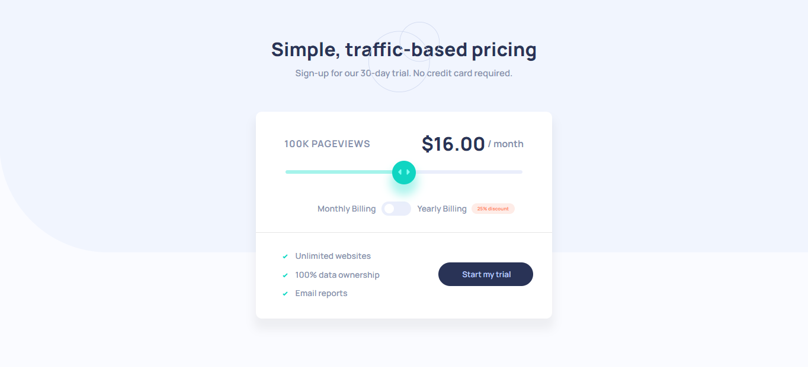

# Frontend Mentor - Interactive pricing component solution


## Table of contents

- [Overview](#overview)
  - [The challenge](#the-challenge)
  - [Screenshot](#screenshot)
  - [Links](#links)
- [My process](#my-process)
  - [Built with](#built-with)
  - [What I learned](#what-i-learned)
  - [Continued development](#continued-development)
  - [Useful resources](#useful-resources)
- [Author](#author)


**Note: Delete this note and update the table of contents based on what sections you keep.**

## Overview
This challenge was taken in the spirit of hacktober fest to better my understanding of Git, HTML, CSS and JavaScript. 

### The challenge

Users should be able to:

- View the optimal layout for the app depending on their device's screen size
- See hover states for all interactive elements on the page
- Use the slider and toggle to see prices for different page view numbers

### Screenshot

- Desktop Version:


- Mobile Version


### Links

- Live Site URL: [Netlify App](https://interhacktober.netlify.app/)


## My process

### Built with

- Semantic HTML5 markup
- CSS custom properties
- Flexbox
- CSS Grid
- Mobile-first workflow
- JavaScript


### What I learned
These are some things that are vital to take note from the 
project.

```html
section class="pricing-container">
    <hgroup>
      <h4 class="page-views">100K</h4> &nbsp;
      <h4 class="page-views"> PAGEVIEWS</h4>
      </hgroup> 
      <div class="slider-container">
        <input type="range" min="0" max="100" value="50"  id="slider"/>
        <div id="selector">
          <div class="select-btn"></div>
        </div>
          <div id="slider-bar"></div>
      </div>    
    <hgroup>
      <h1 id="amount-checker">$16.00</h1> &nbsp <h4>/&nbsp;month</h4>
    </hgroup>
  </section>
```
```css
.app-pattern{  
    background-image: url(./images/bg-pattern.svg);
    background-repeat: no-repeat;
    background-size: cover;
    height: 430px;
    text-align: center;
    position: relative;
    z-index: 1;
    padding: 4rem;
 
}
```
```js
var billingDiscount = document.getElementById('billing-discount');
var Query = window.matchMedia('(max-width:375px)');

myDiscount = (Query) =>{
   if(Query.matches){
    billingDiscount.innerHTML = '-25%';
   }
}

myDiscount(Query);
Query.addEventListener('onload', myDiscount);
```

### Continued development

In subsequent projects I would love to use a css framework to make my work faster and easier. 


### Useful resources

- [Resource ](https://www.w3schools.com/howto/howto_js_media_queries.asp) - This helped me to understand how to manipulate media queries using  JavaScript. I'd recommend it to anyone still learning this concept.


## Author

- Website - [Ohayi James Portfolio Website](https://calculus001.netlify.app)

- Twitter - [@ohayijames](https://www.twitter.com/ohayijames)


