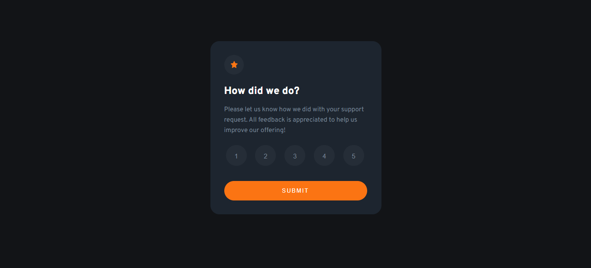
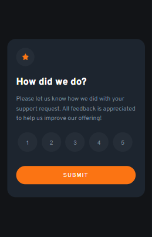

# Frontend Mentor - Interactive rating component solution

This is a solution to the [Interactive rating component challenge on Frontend Mentor](https://www.frontendmentor.io/challenges/interactive-rating-component-koxpeBUmI). Frontend Mentor challenges help you improve your coding skills by building realistic projects. 

## Table of contents

- [Overview](#overview)
  - [The challenge](#the-challenge)
  - [Screenshot](#screenshot)
  - [Links](#links)
- [My process](#my-process)
  - [Built with](#built-with)
  - [What I learned](#what-i-learned)
  - [Continued development](#continued-development)
- [Author](#author)
- [Acknowledgments](#acknowledgments)


## Overview
This challenge is meant to help me understand the use of hover state, focus state, Js foreach, the DOs and DON'Ts of their usage too.

### The challenge

Users should be able to:

- View the optimal layout for the app depending on their device's screen size
- See hover states for all interactive elements on the page
- Select and submit a number rating
- See the "Thank you" card state after submitting a rating

### Added Features 

Users should be able to:

- The back button to take them to the rating page and rate again.


### Screenshot

Desktop View


Desktop View



### Links

- Live Site URL: [Displayed on Netlify](https://ratinghacktober.netlify.app/)

## My process

### Built with

- Semantic HTML5 markup
- CSS custom properties
- Flexbox
- CSS Grid
- Mobile-first workflow
- [SASS](https://sass-lang.com/documentation/) - Stylesheet language that’s compiled to CSS


### What I learned
I learn't the use of SASS and implementation of array foreach method, see below:


```js
clicks.forEach(click=> {
    click.addEventListener('click', function(){
      clicksIndicator.innerHTML = click.innerHTML;
    })
});
```


### Continued development

In my next project I would continue using SASS so as to perfect it and also improve on my understanding of Js.


## Author

- Website - [OHAYI JAMES](https://calculus001.netlify.app)
- Frontend Mentor - [@Sanctogiacomo](https://www.frontendmentor.io/profile/Sanctogiacomo)
- Twitter - [@ohayijames](https://://www.twitter.com/ohayijames)


## Acknowledgments
My mentor has been wonderful in ensuring I am able to achieve and keep on learning. Thank you DEVCAREER for this opportunity.
