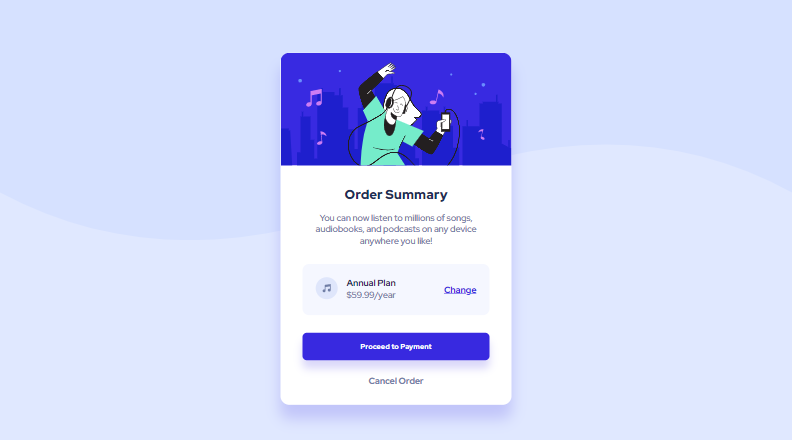
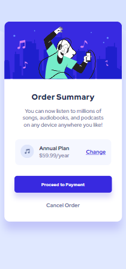

# Frontend Mentor - Order summary card solution

This is a solution to the [Order summary card challenge on Frontend Mentor](https://www.frontendmentor.io/challenges/order-summary-component-QlPmajDUj). Frontend Mentor challenges help you improve your coding skills by building realistic projects. 

## Table of contents

- [Overview](#overview)
  - [The challenge](#the-challenge)
  - [Screenshot](#screenshot)
  - [Links](#links)
- [My process](#my-process)
  - [Built with](#built-with)
  - [What I learned](#what-i-learned)
- [Author](#author)
- [Acknowledgments](#acknowledgments)


## Overview
A simple order summary web application. I achieved this with the knowledge of flex, media queries, sass, and positioning.

### The challenge

Users should be able to:

- See hover states for interactive elements

### Screenshot
 #### Desktop design Screenshot 


 #### Mobile design Screenshot 


### Links
- Live Site URL: [Link to the site on Netlify](https://hacktober-order-summary.netlify.app/)

## My process

### Built with

- Semantic HTML5 markup
- CSS custom properties
- Flexbox
- Deskto[-first workflow
- SASS


### What I learned


To see how you can add code snippets, see below:

```
```css
img{
    width:100%;
}

```

## Author

- Website - [OHAYI JAMES CHUKWUKA](https://calculus001.netlify.app)
- Frontend Mentor - [@sanctogiacomo](https://www.frontendmentor.io/profile/sanctogiacomo)
- Twitter - [@ohayijames](https://www.twitter.com/ohayijames)

## Acknowledgments
I thank my James a friend of mine from the hub at Rumblescube @DevCareer who helped me understood that there is a rule of thumb that I must specify image to be 100% to avoid dangling.


